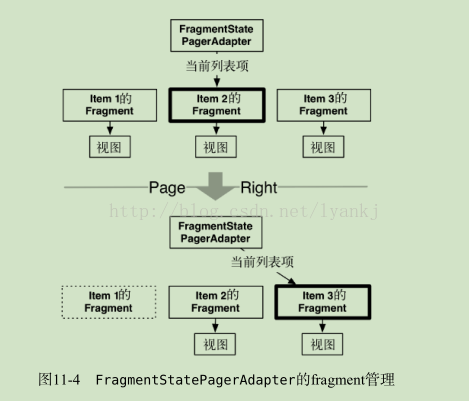
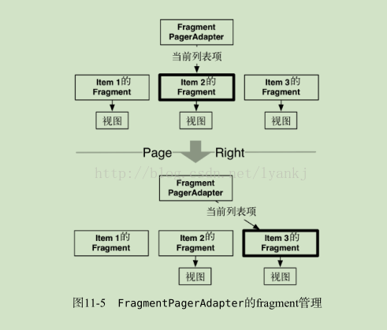

# FragmentPagerAdapter和FragmentStatePagerAdapter区别


## 简单介绍

FragmentPagerAdapter 是另外一种可用的 PagerAdapter ，其用法与 FragmentState-PagerAdapter 基本一致。

唯一的区别在于：卸载不再需要的fragment时，各自采用的处理方法有所不同。

FragmentStatePagerAdapter 会销毁不需要的fragment。事务提交后，activity的 Fragment-Manager 中的fragment会被彻底移除。
FragmentStatePagerAdapter 类名中的“state”表明：在销毁fragment时，可在 onSaveInstanceState(Bundle) 方法中保存fragment的 Bundle 信息。

用户切换回来时，保存的实例状态可用来恢复生成新的fragment（如图11-4所示）。



相比之下， FragmentPagerAdapter 有不同的做法。对于不再需要的fragment， Fragment-
PagerAdapter 会选择调用事务的 detach(Fragment) 方法来处理它，而非 remove(Fragment) 方法。

也就是说， FragmentPagerAdapter 只是销毁了fragment的视图，fragment实例还保留在FragmentManager 中。

因此， FragmentPagerAdapter 创建的fragment永远不会被销毁（如图11-5所示）。




## 下面我们来比较一下两者在加载和销毁fragment item时都做了什么：

#### FragmentPagerAdapter源码：

```java
@Override
    public Object instantiateItem(ViewGroup container, int position) {
        if (mCurTransaction == null) {
            mCurTransaction = mFragmentManager.beginTransaction();
        }
        final long itemId = getItemId(position);
        // Do we already have this fragment?
        String name = makeFragmentName(container.getId(), itemId);
        Fragment fragment = mFragmentManager.findFragmentByTag(name);
        if (fragment != null) {
            if (DEBUG) Log.v(TAG, "Attaching item #" + itemId + ": f=" + fragment);
            mCurTransaction.attach(fragment);
        } else {
            fragment = getItem(position);
            if (DEBUG) Log.v(TAG, "Adding item #" + itemId + ": f=" + fragment);
            mCurTransaction.add(container.getId(), fragment,
                    makeFragmentName(container.getId(), itemId));
        }
        if (fragment != mCurrentPrimaryItem) {
            fragment.setMenuVisibility(false);
            fragment.setUserVisibleHint(false);
        }
        return fragment;
    }
```

在instantiateItem方法中，主要是将Fragment添加到FragmentManager中。未添加到FragmentManager中的执行add操作，已添加到FragmentManager中的只进行attach操作。

```java
@Override
    public void destroyItem(ViewGroup container, int position, Object object) {
        if (mCurTransaction == null) {
            mCurTransaction = mFragmentManager.beginTransaction();
        }
        if (DEBUG) Log.v(TAG, "Detaching item #" + getItemId(position) + ": f=" + object
                + " v=" + ((Fragment)object).getView());
        mCurTransaction.detach((Fragment)object);
    }
```

在destroyItem方法中，只是进行detach操作。detach操作并不会将Fragment销毁，Fragment依旧是由FragmentManager进行管理。

#### FragmentStatePagerAdapter源码：

```java
 @Override
    public Object instantiateItem(ViewGroup container, int position) {
        if (mFragments.size() > position) {
            Fragment f = mFragments.get(position);
            if (f != null) {
                return f;
            }
        }
        if (mCurTransaction == null) {
            mCurTransaction = mFragmentManager.beginTransaction();
        }
        Fragment fragment = getItem(position);
        if (DEBUG) Log.v(TAG, "Adding item #" + position + ": f=" + fragment);
        if (mSavedState.size() > position) {
            Fragment.SavedState fss = mSavedState.get(position);
            if (fss != null) {
                fragment.setInitialSavedState(fss);
            }
        }
        while (mFragments.size() <= position) {
            mFragments.add(null);
        }
        fragment.setMenuVisibility(false);
        fragment.setUserVisibleHint(false);
        mFragments.set(position, fragment);
        mCurTransaction.add(container.getId(), fragment);
        return fragment;
    }
```

FragmentStatePagerAdapter是通过一个mFragments数组来存储fragment的，通过mSavedState数组来存储fragment销毁时的状态，通过position获取到的fragment可能为空（被回收），如果为空，则会再次调用getItem方法重新创建新的fragment，然后将mSavedState中存储的状态重新赋予这个新的fragment， 达到fragment恢复的效果。

```java
 @Override
    public void destroyItem(ViewGroup container, int position, Object object) {
        Fragment fragment = (Fragment) object;
        if (mCurTransaction == null) {
            mCurTransaction = mFragmentManager.beginTransaction();
        }
        if (DEBUG) Log.v(TAG, "Removing item #" + position + ": f=" + object
                + " v=" + ((Fragment)object).getView());
        while (mSavedState.size() <= position) {
            mSavedState.add(null);
        }
        mSavedState.set(position, fragment.isAdded()
                ? mFragmentManager.saveFragmentInstanceState(fragment) : null);
        mFragments.set(position, null);
        mCurTransaction.remove(fragment);
    }
```

当item在页面中不可见时，该fragment的状态会先被保存到mSavedState中，而fragment实例则会被销毁。

### 相同点：

> 两者都会保持当前item（即fragment）和前后的item的状态。
> 显示当前item的同时，Adapter会提前初始化后一个item，并把当前item的前一个item保存在内存中。

### 不同点：

> 在于fragment 存储、恢复、销毁 的方式不同

> 对滑动过去的页面是否销毁：
> 例如：依次从左向右有fragment1，fragment2，fragment3三个页面
>
> FragmentPagerAdapter在滑动到fragment3时，fragment1会依次调用onPause()、onStop()、onDestroyView()，再向左滑动到fragment2时，fragment1会调用onCreateView()、onActivityCreated()、onStart()、onResume()。
> 结论：FragmentPagerAdapter会保留页面的状态，并不会完全销毁掉。
>
> FragmentStatePagerAdapter在滑动到fragment3时，fragment1会依次调用onPause()、onStop()、onDestroyView()、onDestroy()、onDetach()方法，再向左滑动到fragment2时，fragment1会调用onAttach()、onCreate()、onCreateView()、onActivityCreated()、onStart()、onResume()。
> 结论：FragmentStatePagerAdapter会完全销毁滑动过去的item，当需要初始化的时候，会重新初始化页面。

### 如何选择

> ① 选择哪种adapter取决于应用的要求。通常来说，使用 FragmentStatePagerAdapter 更节省内存。
> 如果应用需显示大量记录，每份记录最终还会包含图片。在内存中保存所有信息显然不合适，因此我们选择使用 FragmentStatePagerAdapter 。
>
> ② 另一方面，如果用户界面只需要少量固定的fragment，则 FragmentPagerAdapter 是个安全、合适的选择。
>
> 最常见的例子为分页显示用户界面。例如，某些应用的明细视图所含内容较多，通常需分两页显示。
>
> 这时就可以将这些明细信息分拆开来，以多页面的形式展现。显然，为用户界面添加支持滑动切换的 ViewPager ，
>
> 能增强应用的触摸体验。此外，将fragment保存在内存中，更易于管理控制层的代码。
>
> 对于这种类型的用户界面，每个activity通常只有两三个fragment，基本不用担心有内存不足的风险。

## notifyDataSetChanged后页面不刷新问题解决参考如下链接：

https://www.cnblogs.com/lianghui66/p/3607091.html

对于 FragmentPagerAdapter 的解决方案就是，分别重载 getItem() 以及 instantiateItem() 对象。getItem() 只用于生成新的与数据无关的 Fragment；而 instantiateItem() 函数则先调用父类中的 instantiateItem() 取得所对应的 Fragment 对象，然后，根据对应的数据，调用该对象对应的方法进行数据设置。

当然，不要忘记重载 getItemPosition() 函数，返回 POSITION_NONE，这个两个类的解决方案都需要的。二者不同之处在于，FragmentStatePagerAdapter 在会在因 POSITION_NONE 触发调用的 destroyItem() 中真正的释放资源，重新建立一个新的 Fragment；而 FragmentPagerAdapter 仅仅会在 destroyItem() 中 detach 这个 Fragment，在 instantiateItem() 时会使用旧的 Fragment，并触发 attach，因此没有释放资源及重建的过程。

这样，当 notifyDataSetChanged() 被调用后，会最终触发 instantiateItem()，而不管 getItem() 是否被调用，我们都在重载的 instantiateItem() 函数中已经将所需要的数据传递给了相应的 Fragment。在 Fragment 接下来的 onCreateView(), onStart() 以及 onResume() 的事件中，它可以正确的读取新的数据，Fragment 被成功复用了。

这里需要注意一个问题，在 Fragment 没有被添加到 FragmentManager 之前，我们可以通过 Fragment.setArguments() 来设置参数，并在 Fragment 中，使用 getArguments() 来取得参数。这是常用的参数传递方式。但是这种方式对于我们说的情况不适用。因为这种数据传递方式只可能用一次，在 Fragment 被添加到 FragmentManager 后，一旦被使用，我们再次调用 setArguments() 将会导致 **java.lang.IllegalStateException: Fragment already active** 异常。因此，我们这里的参数传递方式选择是，在继承的 Fragment 子类中，新增几个 setter，然后通过这些 setter 将数据传递过去。反向也是类似。相关信息可以参考 [5]。哦，这些 setter 中要注意不要操作那些 View，这些 View 只有在 onCreateView() 事件后才可以操作。


针对 FragmentPagerAdapter 的解决办法如下列代码所示：

```java
@Override
public Fragment getItem(int position) {
   MyFragment f = new MyFragment();
   return f;
}

@Override
public Object instantiateItem(ViewGroup container, int position) {
   MyFragment f = (MyFragment) super.instantiateItem(container, position);
   String title = mList.get(position);
   f.setTitle(title);
   return f;
}

@Override
public int getItemPosition(Object object) {
   return PagerAdapter.POSITION_NONE;
}
```